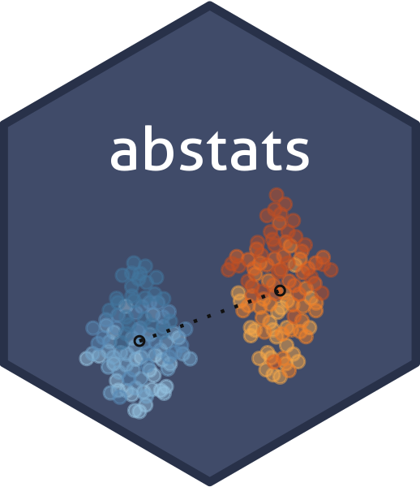

<!-- README.md is generated from README.Rmd. Please edit that file -->

```{r, include = FALSE}
knitr::opts_chunk$set(
  collapse = TRUE,
  comment = "#>",
  fig.path = "man/figures/README-",
  out.width = "100%"
)

options(knitr.table.format = 'markdown')
```

# abstats <a href='https://okiyuki99.github.io/abstats/'></a>

<!-- badges: start -->
[](https://travis-ci.org/okiyuki99/abstats)
[](https://ci.appveyor.com/project/okiyuki99/abstats)
[](https://codecov.io/gh/okiyuki99/abstats?branch=master)
[](https://www.tidyverse.org/lifecycle/#experimental)
<!-- badges: end -->

Statistical methods for A/B test Analysis and Research

# Installation

You can install the development version from github with:

```r
# install.packages("remotes")
remotes::install_github("okiyuki99/abstats")
```

